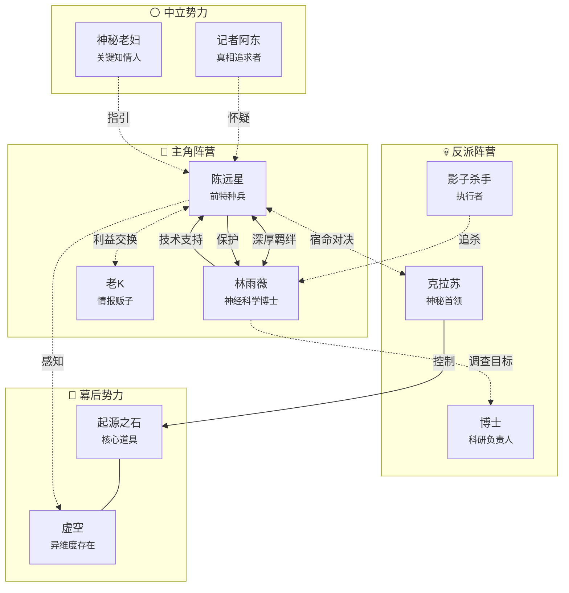

# 全局人物关系图

> 📊 **自动生成** - 运行 `02_scripts/关系图生成器.md` 中的脚本自动更新

---

## 🕸️ 全局关系图

---

## 📊 关系统计

| 指标 | 数值 |
|------|------|
| 总角色数 | 9 |
| 主角阵营 | 3 |
| 反派阵营 | 3 |
| 中立势力 | 2 |
| 幕后势力 | 2 |

---

## 🔗 阵营关系

| 阵营A | 关系 | 阵营B | 说明 |
|-------|------|-------|------|
| 主角阵营 | ⚔️ 对立 | 反派阵营 | 主要冲突线 |
| 主角阵营 | 🔍 调查 | 中立势力 | 信息获取 |
| 反派阵营 | 🔮 控制 | 幕后势力 | 核心驱动力 |

---

## 📋 关系类型说明

| 符号 | 类型 | 说明 |
|------|------|------|
| `====` | 家人/恋人 | 深厚血缘或爱情关系 |
| `<-->` | 盟友 | 双向信任合作 |
| `-->` | 指导 | 单向教导或保护 |
| `-.-` | 敌对 | 单向敌意或追杀 |
| `...` | 中立 | 无特别关系 |

---

## 💡 使用说明

### 自动更新
1. 运行 `../02_scripts/关系图生成器.md` 中的 DataviewJS 脚本
2. 复制生成的 Mermaid 代码到上方代码块
3. 图表将自动渲染

### 手动维护
直接在 Mermaid 代码块中编辑关系定义

---

*最后更新：2026-05-11*
