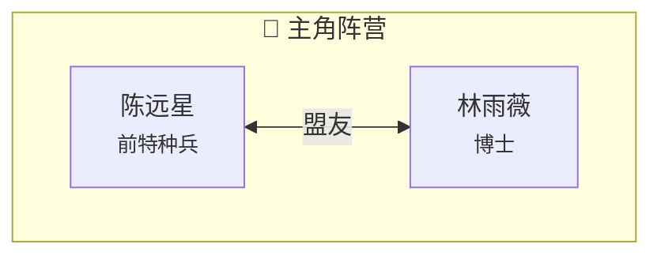

# 🚀 Obsidian 小说可视化工具包 - 使用教程

> 本教程将教你如何高效使用小说可视化工具包

---

## 📝 日常工作流程

### 流程概览

```
1. 创建角色笔记 → 2. 定义关系 → 3. 编写章节 → 4. 标注事件 → 5. 更新可视化
```

---

## 🎭 第一步：创建角色笔记

### 快速创建

1. 按 `Ctrl/Cmd + P` 打开命令面板
2. 输入 `Templater: Create new note from template`
3. 选择 `角色模板.md`
4. 输入文件名（如 `陈远星.md`）

### 必填字段

```yaml
---
uid: chen-yuanxing          # 唯一ID（英文/数字/短横线）
name: 陈远星                # 角色姓名（必需）
faction: protagonist-team  # 阵营ID
role: protagonist           # 角色定位
---
```

### 可选字段

```yaml
alias: ["星哥", "远星"]     # 别名列表
status: alive               # 存活状态
age: 28                     # 年龄
occupation: 前特种兵        # 职业
```

### 完整示例

```yaml
---
uid: chen-yuanxing
name: 陈远星
alias: ["星哥", "远星"]
faction: protagonist-team
role: protagonist
status: alive
first-appearance: 1
gender: 男
age: 28
occupation: 前特种兵
location: 云城

relations:
  - target: lin-yuwei
    type: ally
    strength: strong
    start-chapter: 1
    note: 深厚的信任与羁绊

attributes:
  personality: 冷静、理性、内心封闭但重视承诺
  ability: 虚空感知
  weakness: 军牌创伤
  habit: 摩挲旧物
  catchphrase: "从概率上说..."

events:
  - chapter: 1
    event: 首次出场
    significance: major
  - chapter: 5
    event: 能力觉醒
    significance: major
---
```

---

## 🔗 第二步：定义角色关系

### 关系类型

| 类型 | 符号 | 说明 |
|------|------|------|
| `ally` | `<-->` | 盟友关系 |
| `enemy` | `-.-` | 敌对关系 |
| `family` | `====` | 家人关系 |
| `romantic` | `==>` | 恋人关系 |
| `mentor` | `-->` | 师徒关系 |
| `rival` | `-.-` | 竞争关系 |
| `neutral` | `...` | 中立关系 |

### 关系强度

| 强度 | 说明 |
|------|------|
| `intense` | 生死之交或血海深仇 |
| `strong` | 深厚羁绊 |
| `moderate` | 一般关系 |
| `weak` | 表面关系 |

### 定义示例

```yaml
relations:
  - target: lin-yuwei              # 目标角色UID
    type: ally                     # 关系类型
    strength: strong                # 强度
    start-chapter: 1              # 开始章节
    end-chapter:                  # 结束章节（可选）
    note: 深厚的信任与羁绊         # 备注
```

---

## 📖 第三步：创建章节笔记

### 快速创建

1. 命令面板 → `Templater: Create new note from template`
2. 选择 `章节模板.md`
3. 输入文件名（如 `ch001.md`）

### 必填字段

```yaml
---
uid: ch001                       # 唯一ID
title: 命运的相遇                # 章节标题
chapter: 1                       # 章节号
volume: volume-01                # 卷ID
point-of-view: 陈远星            # 视角角色
---
```

### 定义出场角色

```yaml
characters-present:
  - chen-yuanxing                 # 角色UID
  - lin-yuwei
```

### 定义关系变化

```yaml
relationship-changes:
  - pair: [chen-yuanxing, lin-yuwei]
    change: first-meeting
    note: "初次相遇，产生微妙联系"
```

---

## ⏰ 第四步：标注时间线事件

### 事件格式

```yaml
timeline-events:
  - event: 陈远星便利店偶遇林雨薇
    type: encounter              # 事件类型
    significance: major          # 重要性
    chapter: ch001
```

### 重要性等级

| 等级 | 说明 | 标记 |
|------|------|------|
| `major` | 重大事件 | ⭐⭐⭐ |
| `important` | 重要事件 | ⭐⭐ |
| `minor` | 一般事件 | ⭐ |

---

## 🔮 第五步：铺设伏笔

### 伏笔格式

```yaml
foreshadows:
  - id: foreshadow-001
    name: 0.333Hz信号
    planted: ch001               # 铺设章节
    status: planted              # 状态
    expected-reveal: ch015       # 预期回收章节
    description: 林雨薇手机收到的神秘信号
```

### 伏笔状态

| 状态 | 说明 |
|------|------|
| `planted` | 已铺设，等待激活 |
| `activated` | 已激活，即将回收 |
| `resolved` | 已回收 |

---

## 📊 第六步：更新可视化

### 方法一：自动生成（推荐）

1. 打开 `scripts/关系图生成器.md`
2. 运行 DataviewJS 代码块
3. 复制生成的 Mermaid 代码
4. 粘贴到 `visualization/全局关系图.md`

### 方法二：手动编辑

直接编辑 Mermaid 代码块：



### 时间线更新

直接编辑 Timeline 代码块：

```timeline
type: timeline
subtitle: 《你的书名》时间线

### 第一卷

- date: 第1章
  content: |
    **首次出场**
    - 角色相遇
```

---

## 📈 第七步：查看统计数据

### 一键统计

1. 打开 `scripts/快速统计面板.md`
2. 运行 DataviewJS 代码块
3. 查看自动生成的统计面板

### 统计内容

- 角色总数、关系总数
- 章节进度
- 伏笔铺设/回收状态
- 关系类型分布

---

## 💡 高级技巧

### 技巧1：批量创建角色

使用 QuickAdd 宏批量创建：

1. 设置 → QuickAdd → 添加宏
2. 选择"创建多个文件"
3. 设置角色列表
4. 一键生成所有角色笔记

### 技巧2：双向链接

在角色笔记中使用双向链接：

```markdown
## 相关笔记

- [[林雨薇]] - 盟友
- [[克拉苏]] - 宿敌
```

### 技巧3：快速跳转

使用 Obsidian 的快速切换：

- `Ctrl/Cmd + O`：快速打开文件
- `Ctrl/Cmd + D`：快速切换到同名文件
- `[[`：快速创建链接

### 技巧4：标签管理

使用标签组织内容：

```yaml
tags:
  - character
  - protagonist-team
  - protagonist
```

---

## 🔄 更新流程示例

### 场景：完成新章节后

1. **更新章节笔记**
   - 填写 `timeline-events`
   - 填写 `relationship-changes`
   - 铺设新的 `foreshadows`

2. **更新角色笔记**
   - 添加新的关系（如有新角色）
   - 更新关系强度（如有变化）

3. **更新可视化**
   - 运行关系图生成器
   - 运行时间线生成器
   - 更新伏笔追踪表

4. **查看统计**
   - 运行快速统计面板
   - 检查进度

---

## 🎯 最佳实践

### ✅ 推荐

- 每创建新角色，立即定义关系
- 每完成章节，立即标注事件
- 每周运行一次统计面板
- 使用一致的命名规范（UID）

### ❌ 避免

- 一次性创建大量角色后再定义关系
- 跳过 YAML 元数据填写
- 忽视伏笔状态更新

---

## 📞 常见问题

### Q: 如何批量更新关系图？

**A**: 运行 `关系图生成器.md` 中的脚本，复制输出即可。

### Q: 关系变化如何记录？

**A**: 在章节笔记的 `relationship-changes` 字段中记录，生成器会自动汇总。

### Q: 伏笔忘记铺设了怎么办？

**A**: 在角色或章节笔记的 `foreshadows` 字段中补充添加。

### Q: 如何删除角色？

**A**: 删除笔记后，需要手动从关系图中移除对应节点。

---

## 🎉 总结

本工具包的核心价值：

1. **结构化管理** - YAML 元数据确保数据一致
2. **自动化生成** - DataviewJS 自动提取和生成
3. **可视化呈现** - Mermaid + Timeline 双重视图
4. **统计分析** - 一键查看项目状态

掌握以上流程，你就能高效管理复杂的小说项目了！

---

**下一步**：开始创建你的第一个角色笔记吧！
