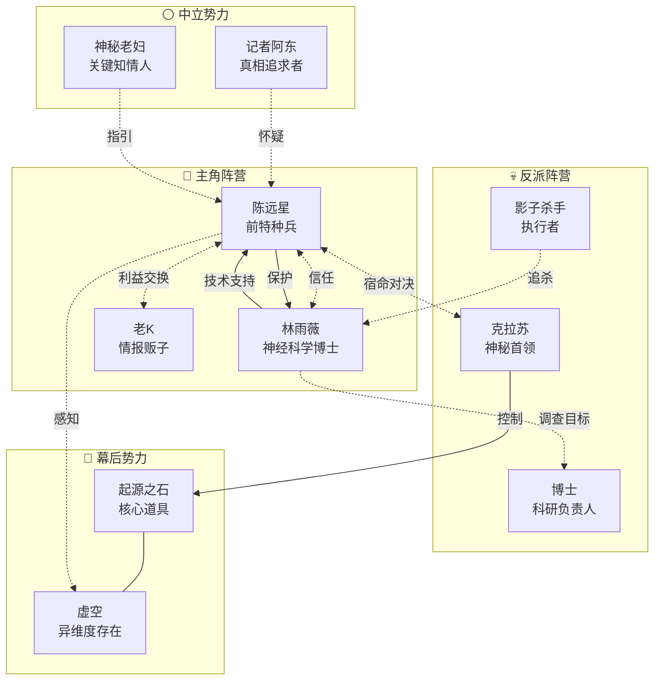
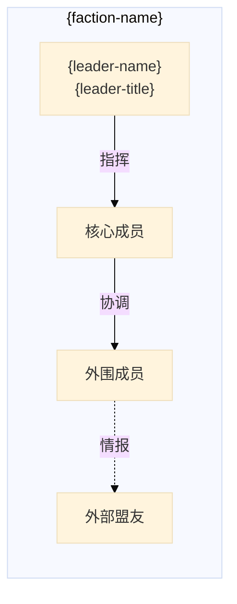

# Obsidian 小说可视化工具设计

> 版本：v1.0
> 日期：2026-05-11
> 状态：设计阶段

---

## 1. 概念与愿景

一个Obsidian插件组合方案，用于可视化小说中的人物关系网络和时间线进展。核心价值在于：**通过分层视图将复杂的角色网络和情节时间线可视化，帮助作者直观把握故事的全貌和细节**。

设计理念：
- **分层递进**：从宏观（全书）→ 中观（卷/阵营）→ 微观（章节/事件）
- **双向驱动**：通过笔记间的双向链接自动更新图表
- **作者友好**：无需编程知识，通过YAML元数据定义角色和事件

---

## 2. 设计架构

### 2.1 分层视图结构

```
┌─────────────────────────────────────────────────────────┐
│                    全局视图                               │
│  ┌─────────────┐  ┌─────────────┐  ┌─────────────┐     │
│  │ 主角关系图  │  │ 阵营关系图   │  │  全书时间线  │     │
│  └─────────────┘  └─────────────┘  └─────────────┘     │
└─────────────────────────────────────────────────────────┘
                          ↓
┌─────────────────────────────────────────────────────────┐
│                    卷视图（按卷分组）                     │
│  ┌─────────────┐  ┌─────────────┐  ┌─────────────┐     │
│  │  第一卷关系  │  │  第二卷关系  │  │  第三卷关系  │     │
│  └─────────────┘  └─────────────┘  └─────────────┘     │
└─────────────────────────────────────────────────────────┘
                          ↓
┌─────────────────────────────────────────────────────────┐
│                    章节视图（按情节线）                   │
│  ┌─────────────┐  ┌─────────────┐  ┌─────────────┐     │
│  │  主线时间线  │  │  支线时间线  │  │  隐藏线时间线 │     │
│  └─────────────┘  └─────────────┘  └─────────────┘     │
└─────────────────────────────────────────────────────────┘
```

### 2.2 文件结构

```
Novel Understanding/
├── 📊 visualization/              # 可视化文件夹
│   ├── 📈 global-relationship.md # 全局关系图（Mermaid）
│   ├── 🗺️ global-timeline.md     # 全局时间线
│   ├── 📂 factions/               # 阵营关系图
│   │   ├── protagonist-team.md   # 主角阵营
│   │   ├── antagonist-group.md   # 反派阵营
│   │   └── neutral-faction.md    # 中立势力
│   ├── 📜 volumes/                # 卷视图
│   │   ├── volume-01.md          # 第1卷
│   │   └── volume-02.md          # 第2卷
│   └── 🔮 plotlines/              # 情节线视图
│       ├── main-plot.md           # 主线
│       ├── subplot-a.md           # 支线A
│       └── hidden-plot.md         # 隐藏线
│
├── 👥 characters/                 # 角色笔记库
│   ├── protagonist.md             # 主角
│   ├── deuteragonist.md          # 配角
│   └── character-template.md      # 角色模板
│
├── 📖 chapters/                   # 章节笔记
│   ├── ch001.md
│   ├── ch002.md
│   └── chapter-template.md        # 章节模板
│
├── ⚙️ scripts/                    # 自动化脚本
│   ├── relationship-generator.js  # 关系图生成器
│   ├── timeline-generator.js      # 时间线生成器
│   └── update-trigger.md          # 更新触发器（通过Dataview）
│
└── 📋 metadata/                   # 元数据配置
    ├── relationship-definitions.md # 关系定义
    └── timeline-events.md          # 时间线事件
```

### 2.3 数据流向

```
┌─────────────────┐
│  characters/*.md │ ← 角色笔记（YAML元数据）
└────────┬────────┘
         │ DataviewJS 查询
         ↓
┌─────────────────┐
│ relationship-    │
│ generator.js    │ → 生成 Mermaid 代码
└────────┬────────┘
         ↓
┌─────────────────┐     ┌─────────────────┐
│ global-         │     │ faction-        │
│ relationship.md │     │ *.md            │
└─────────────────┘     └─────────────────┘

┌─────────────────┐
│  chapters/*.md  │ ← 章节笔记（YAML元数据）
└────────┬────────┘
         │ DataviewJS 查询
         ↓
┌─────────────────┐
│ timeline-       │ → 生成 Timeline 视图
│ generator.js   │
└────────┬────────┘
         ↓
┌─────────────────┐
│ global-         │
│ timeline.md     │
└─────────────────┘
```

---

## 3. 核心组件设计

### 3.1 角色笔记模板

```yaml
---
uid: protagonist-001
name: 陈远星
alias: ["星哥", "远星"]
faction: protagonist-team
role: protagonist
status: alive
first-appearance: ch001
# 关系定义（使用 relation-type 标签）
relations:
  - target: deuteragonist-001
    type: ally
    strength: strong
    start-chapter: ch001
  - target: antagonist-001
    type: enemy
    strength: intense
    start-chapter: ch003
# 时间线事件
events:
  - chapter: ch001
    event: 首次出场
  - chapter: ch005
    event: 能力觉醒
  - chapter: ch010
    event: 重大抉择
# 角色属性（用于卡片展示）
attributes:
  age: 28
  occupation: 前特种兵
  ability: 虚空感知
  weakness: 军牌创伤
---

# 陈远星

## 基本信息

- **年龄**：28岁
- **身份**：前特种兵，现为私人安全顾问
- **核心能力**：虚空感知（可感知超自然存在的存在）

## 角色弧光

### 起点
对战友之死怀有深深愧疚，封闭内心

### 转折点（第5章）
能力觉醒，被迫面对过去

### 终点
放下执念，找到新的人生意义

## 记忆点

- 🔑 军牌（战友遗物）
- ⚡ 虚空感知触发时后颈发凉
- 💔 每次提到"天狼星小队"会沉默

## 关键关系

![[protagonist-001#relations]]

## 出场章节

- 第1章：首次出场
- 第5章：能力觉醒
- 第10章：重大抉择

## 相关笔记

- [[deuteragonist-001]] - 盟友
- [[antagonist-001]] - 宿敌
```

### 3.2 章节笔记模板

```yaml
---
uid: ch001
title: 第一章：命运的相遇
chapter: 1
volume: volume-01
point-of-view: 陈远星
point-of-view-percentage: 100
date: 故事开始前3个月
season: 春季
location: 云城
# 情节线标记
plotlines:
  - main-plot         # 主线
  - protagonist-arc   # 主角弧光
# 本章出场角色
characters-present:
  - protagonist-001  # 陈远星
  - deuteragonist-001 # 林雨薇
  - npc-001          # 便利店店员
# 本章关系变化
relationship-changes:
  - pair: [protagonist-001, deuteragonist-001]
    change: first-meeting
    note: "初次相遇，产生微妙联系"
# 时间线事件
timeline-events:
  - event: 陈远星便利店偶遇林雨薇
    significance: major
  - event: 林雨薇委托保护任务
    significance: minor
# 伏笔铺设
foreshadows:
  - id: foreshadow-001
    name: 0.333Hz信号
    chapter: ch001
    status: planted
    expected-reveal: ch015
# 钩子
hooks:
  - type: suspense
    content: "林雨薇为何能感知到普通人无法察觉的存在？"
  - type: conflict
    content: "神秘势力开始追踪林雨薇"
---

# 第一章：命运的相遇

## 章节摘要

[在此处撰写章节内容]

## 本章关系变化

- 陈远星 ↔ 林雨薇：**首次相遇**
  - 初始印象：陌生人 → 微妙的联系

## 本章关键事件

1. 🌙 深夜便利店相遇
2. 📱 林雨薇接到神秘电话
3. 👁️ 陈远星首次感知到异常

## 伏笔记录

- 🔮 **0.333Hz信号**：林雨薇的手机收到一段异常频率的信号
  - 状态：已铺设
  - 预期回收：第15章
```

### 3.3 关系定义（中心配置）

```yaml
# relationship-definitions.md

## 关系类型定义

| 类型 | 标签 | 说明 | Mermaid线型 |
|------|------|------|-------------|
| ally | 盟友 | 友好合作关系 | -- |
| enemy | 敌对 | 敌对冲突关系 | -.-> |
| family | 家人 | 血缘或收养关系 | == |
| romantic | 恋人 | 爱情关系 | ==> |
| mentor | 师徒 | 教导关系 | -->> |
| rival | 竞争 | 竞争关系 | -.->> |
| neutral | 中立 | 无特别关系 | ... |

## 关系强度

| 强度 | 标签 | 说明 |
|------|------|------|
| intense | 强烈 | 生死之交或血海深仇 |
| strong | 强 | 深厚羁绊 |
| moderate | 中等 | 一般关系 |
| weak | 弱 | 表面关系 |

## 阵营定义

| 阵营ID | 阵营名 | 说明 |
|--------|--------|------|
| protagonist-team | 主角阵营 | 正派主角团队 |
| antagonist-group | 反派阵营 | 主要敌人 |
| neutral-faction | 中立势力 | 不归属任何一方 |
| mysterious-org | 神秘组织 | 幕后势力 |

## 颜色方案（Mermaid）

```mermaid
%%{init: {'theme': 'base', 'themeVariables': {
  '-- protagonist-team': '#4CAF50',
  '-- antagonist-group': '#F44336',
  '-- neutral-faction': '#9E9E9E',
  '-- mysterious-org': '#9C27B0'
}}%%
```
```

---

## 4. Mermaid 关系图生成

### 4.1 全局关系图（Mermaid代码）



### 4.2 阵营关系图（模板）



---

## 5. Timeline 插件配置

### 5.1 全局时间线配置

```markdown
---

## 全书时间线

type: timeline
subtitle: 《虚空觉醒》关键事件

### 第一卷：觉醒

- date: 故事开始
  content: |
    **第1章：命运的相遇**
    - 陈远星与林雨薇相遇
    - 0.333Hz信号首次出现
    - 神秘势力开始追踪

- date: 第5章
  content: |
    **能力觉醒**
    - 陈远星虚空感知能力首次触发
    - 后颈发凉的标志性反应确立
    - 命运齿轮开始转动

- date: 第10章
  content: |
    **第一次决战**
    - 主角团 vs 影子杀手
    - 林雨薇身陷危机
    - 克拉苏首次现身

### 第二卷：迷雾

- date: 第15章
  content: |
    **真相揭示**
    - 0.333Hz信号来源揭晓
    - 林雨薇身世之谜
    - 老K背叛真相

- date: 第20章
  content: |
    **阵营分裂**
    - 主角团内部矛盾爆发
    - 陈远星面临抉择
    - 神秘老妇登场
```

### 5.2 时间线生成器脚本

```javascript
// timeline-generator.js
// 使用 DataviewJS 自动生成时间线

dv.table(
    ["日期", "章节", "事件", "类型", "重要性"],
    dv.pages('"chapters"')
        .filter(p => p["timeline-events"])
        .flatMap(p => 
            p["timeline-events"].map(e => [
                p.date || "未知",
                `[[${p.file.name}}|第${p.chapter}章]]`,
                e.event,
                e.type || "一般",
                e.significance === "major" ? "⭐重要" : "一般"
            ])
        )
        .sort((a, b) => a[0].localeCompare(b[0]))
);
```

---

## 6. 自动化机制

### 6.1 Dataview 自动查询

```javascript
// relationship-auto-update.js
// 自动从角色笔记中提取关系并生成Mermaid代码

const characters = dv.pages('"characters"')
    .where(p => p.relations);

let mermaidCode = `flowchart TB\n`;
mermaidCode += `    subgraph ALL["全书关系图"]\n`;

characters.forEach(char => {
    if (char.relations) {
        char.relations.forEach(rel => {
            const target = dv.page(rel.target);
            if (target) {
                const lineType = getLineType(rel.type);
                const strength = getStrength(rel.strength);
                mermaidCode += `        ${char.uid}("${char.name}") ${lineType} "${strength}" ${target.uid}("${target.name}")\n`;
            }
        });
    }
});

mermaidCode += `    end\n`;

function getLineType(type) {
    const types = {
        'ally': '<-->',
        'enemy': '-.->',
        'family': '==>',
        'romantic': '==>',
        'mentor': '-->',
        'rival': '-.->>'
    };
    return types[type] || '---';
}

function getStrength(strength) {
    const strengths = {
        'intense': '生死之交',
        'strong': '深厚羁绊',
        'moderate': '一般',
        'weak': '表面'
    };
    return strengths[strength] || '';
}

// 输出到控制台（需要手动复制到Mermaid块）
console.log(mermaidCode);
```

### 6.2 Templater 模板触发

```javascript
// update-on-link.js
// 当链接到新角色时自动更新关系图

<%*
// 获取当前笔记的YAML
const yaml = this.app.metadataCache.getFileCache(tp.file.path()).frontmatter;

// 如果定义了关系，自动追加到关系定义文件
if (yaml.relations) {
    const relFile = tp.config.target_file.folder + '/metadata/relationship-definitions.md';
    
    // TODO: 实现自动追加逻辑
}
%>
```

---

## 7. 使用流程

### 7.1 初始化流程

```
1. 创建笔记仓库
   ↓
2. 复制角色模板 → 创建第一个角色笔记
   ↓
3. 复制章节模板 → 创建第一章
   ↓
4. 在角色笔记中定义关系（YAML）
   ↓
5. 在章节笔记中定义事件（YAML）
   ↓
6. DataviewJS 自动生成关系图代码
   ↓
7. 复制代码到可视化笔记
   ↓
8. Obsidian 渲染 Mermaid + Timeline
```

### 7.2 写作更新流程

```
1. 写新章节
   ↓
2. 更新角色笔记中的关系（添加/修改）
   ↓
3. 更新章节笔记中的事件（添加/修改）
   ↓
4. 触发更新脚本
   ↓
5. 可视化自动刷新
```

---

## 8. 插件依赖

| 插件 | 必需 | 说明 |
|------|------|------|
| **Dataview** | ✅ 必需 | 查询笔记、生成动态内容 |
| **Templater** | ✅ 必需 | 模板生成、自动化脚本 |
| **Timeline** | ✅ 必需 | 时间线可视化 |
| **Mermaid** | ✅ 必需 | 关系图渲染（内置） |
| **QuickAdd** | ⚡ 推荐 | 快速创建笔记 |
| **MetaEdit** | ⚡ 推荐 | YAML编辑辅助 |
| **Buttons** | ○ 可选 | 可视化更新按钮 |

---

## 9. 优势与限制

### ✅ 优势

1. **完全免费**：基于开源插件组合
2. **数据主权**：笔记存储在本地，无云服务依赖
3. **高度可定制**：通过修改模板和脚本适应各种需求
4. **Markdown原生**：与Obsidian笔记完全融合
5. **自动化程度高**：DataviewJS自动提取数据

### ⚠️ 限制

1. **Mermaid限制**：
   - 复杂网络图可能渲染缓慢
   - 不支持动态交互
   - 连线样式有限

2. **Timeline插件限制**：
   - 样式定制需要CSS知识
   - 不支持中文日期格式
   - 无法精确到具体时间点

3. **DataviewJS限制**：
   - 需要学习基础JavaScript
   - 复杂查询可能影响性能
   - 无法自动更新Mermaid代码（需手动复制）

---

## 10. 未来扩展

### 10.1 潜在增强

| 功能 | 描述 | 优先级 |
|------|------|--------|
| **交互式关系图** | 使用Excalidraw替代Mermaid，支持点击交互 | ⭐⭐⭐ |
| **自动更新脚本** | 写一个自动化脚本，一键更新所有可视化 | ⭐⭐⭐ |
| **角色卡片视图** | 使用Admonitions展示角色属性卡 | ⭐⭐ |
| **情节线追踪** | 可视化伏笔的铺设与回收 | ⭐⭐ |
| **阵营势力地图** | 地理/势力范围可视化 | ⭐ |

### 10.2 替代方案

如果未来需要更强大的可视化能力，可以考虑：

1. **Excalidraw方案**：使用Excalidraw插件绘制手绘风格关系图
   - ✅ 优势：可交互、可自定义、有社区分享模板
   - ❌ 劣势：需要手动维护，无法自动更新

2. **自定义插件**：编写Obsidian插件
   - ✅ 优势：完全控制、功能强大
   - ❌ 劣势：开发成本高、需要JavaScript/TypeScript经验

---

## 11. 设计验证

### 11.1 核心需求满足度

| 需求 | 满足方式 | 状态 |
|------|---------|------|
| 人物关系可视化 | Mermaid flowchart | ✅ |
| 包含角色属性卡片 | YAML元数据 + 笔记内容 | ✅ |
| 时间线（章节级） | Timeline插件 | ✅ |
| 时间线（事件级） | Timeline插件 + YAML | ✅ |
| 自动化更新 | DataviewJS + Templater | ✅ |
| 适配Obsidian | 纯插件方案 | ✅ |

### 11.2 复杂度评估

| 维度 | 评分 | 说明 |
|------|------|------|
| 初始配置 | ⭐⭐☆☆☆ | 需要安装插件和设置模板 |
| 学习曲线 | ⭐⭐⭐☆☆ | 需要学习DataviewJS基础 |
| 维护成本 | ⭐⭐☆☆☆ | 主要是写YAML元数据 |
| 扩展性 | ⭐⭐⭐⭐☆ | 可通过脚本无限扩展 |

---

*设计文档结束*

**下一步**：等待用户确认设计后，编写详细实现计划。
